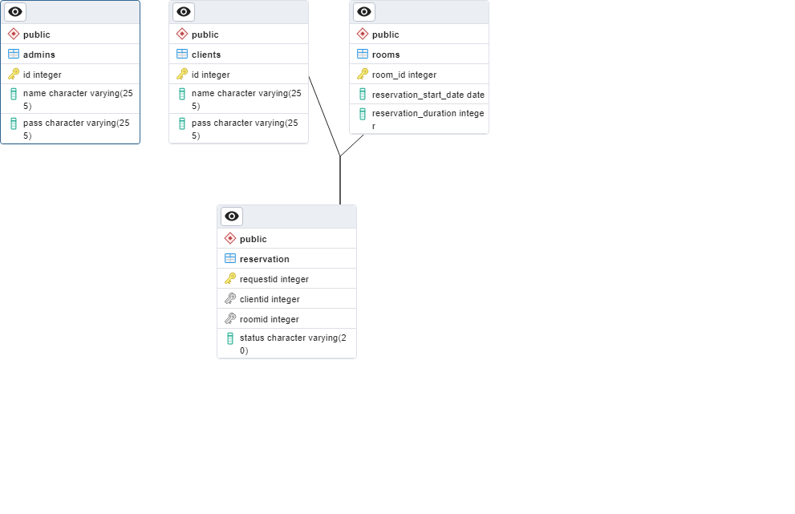

# Hotel Administration App

This is a simple hotel administration application built with Java SE, utilizing JFrame for the user interface. It is designed with a PostgreSQL database and follows the MVC pattern to maintain a clean architecture. The app supports basic CRUD (Create, Read, Update, Delete) operations.

## Project Structure
- **Model-View-Controller (MVC)**: The application is structured following the MVC pattern, which helps in separating the concerns:
  - **Model**: Handles the data and business logic.
  - **View**: Manages the user interface.
  - **Controller**: Acts as an intermediary between the model and view.

## Database
- **PostgreSQL**: The application uses a PostgreSQL database to store and manage hotel data.

## Diagram


## Setup Instructions

### Prerequisites
- Java Development Kit (JDK)
- PostgreSQL Database
- IDE such as IntelliJ IDEA or Eclipse

### Steps to Create Database
1. Install PostgreSQL and ensure it is running.
2. Open `tp.txt` for detailed steps to set up the database.
3. Follow the instructions in `tp.txt` to create the necessary tables and insert initial data.

### Adding PostgreSQL to the Context
- Ensure you have the PostgreSQL JDBC driver added to your project dependencies.
- Configure the database connection parameters in your Java application.

### Running the Application
1. Clone this repository:
    ```bash
    git clone https://github.com/yourusername/hotel-administration-app.git
    cd hotel-administration-app
    ```
2. Open the project in your IDE.
3. Ensure that the PostgreSQL database is set up correctly as per the instructions in `tp.txt`.
4. Run the main class to start the application.

### Features
- **CRUD Operations**: Perform create, read, update, and delete operations on hotel records.
- **MVC Pattern**: Ensures a clean separation of concerns and maintainable code structure.
- **PostgreSQL Integration**: Uses PostgreSQL for reliable and efficient data management.

## Contributing
Contributions are welcome! Please fork the repository and submit a pull request with your changes.

## License
This project is licensed under the MIT License. See the `LICENSE` file for more details.

## Contact
For any questions or suggestions, please open an issue or reach out to [tari9bro@gmail.com].

---

Follow the instructions in `tp.txt` to set up the database and add PostgreSQL to the project context. This simple project is fundamental for understanding the implementation of CRUD operations using the MVC pattern in a clean architecture.

Happy coding!
